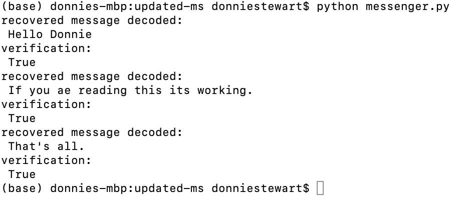

To run:
- clone the repo at https://git.ucsc.edu/CSE234-W21/dolstewa.git
- cd into updated-ms
- key ratchet procedure is: [click Here](https://git.ucsc.edu/CSE234-W21/dolstewa/-/blob/master/updated-ms/keyratchet.pdf)
- execute "python messenger.py"
- Running this will create and send four encrypted messages to aws. Then they will be received from from aws decrypted and displayed. The sender will also be verified. Print statements correspond to the values needed and cipher text will be found in the .txt files
- I also got to exchange messages with Surya Keswani!
- Here is a picture of three messages I received from Surya: 

